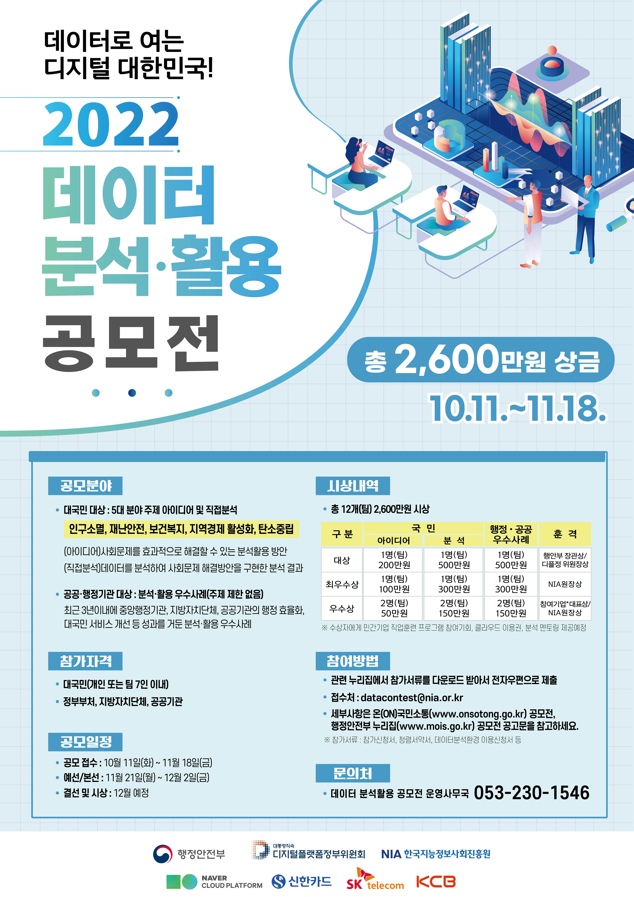

Mulitcampus 4조 22년 10월 project 자료를 모아 놓은 Repository입니다.
# 프로젝트
1.교통사고
 - 장점
    - 데이터가 많음
    - dacon같은 대회와 병행할 수 있음  
2. 야구
  - 
3. 탄소 배출량 변화와 자연 대해 상관 관계 시각화
4. 물가 상승으로 인한 지역별 소비행태 변화
5. 지역별 생활 인프라 대비 만족도 대시보드
6. 기타
  - 뉴스 특정 단어 중복성 판단해서 트랜드처럼 만들어보기
  - 스마트폰 사용으로 문해력이 떨어졌을까?

# 이재혁
## 어떤 주제로 할 것인지
1. [Dacon](https://dacon.io/)
    -[KOSPI 데이터](https://dacon.io/competitions/official/235980/data)
2. [공공데이터포탈](https://www.data.go.kr/)
    1. [**인천광역시_수도권 교통사고 정보**](https://www.data.go.kr/data/15065733/openapi.do)
    2. 교통사고의 인적인 피해와 사고유형/법규위반/도로형태/차량형태 특성이 각각 선형성을 가지고 있는지 분석해보기
3. 트랜드
    1. 특정 기간의 뉴스를 긁어서 제목에서 중복되는 특정 단어의 개수를 시각화하기
4. [빅데이터센터](https://kbig.kr/portal/kbig/datacube.page)

# 박수빈
# 어떤 주제로 할 것인지

+ 노인들의 교통사고 분석
   [공공데이터포털] (https://www.data.go.kr/data/15094162/fileData.do?recommendDataYn=Y)

+ 야구 정규시즌 데이터를 활용하여 다음 시즌 순위 예측
   [KBO] (https://www.koreabaseball.com/)

+ 데이터 분석 대회 포함 (안내 보면 주제 5개 중 고를 수 있어서 명확하게 하나 정하지 않았습니다 !) (https://onsotong.go.kr/front/epilogue/epilogueBbsViewPage.do?bbs_id=206dcfa5305e4b5f8313c481169abcea&searchkey=A&searchtxt=&miv_pageNo=2)

# 김남규
+ [Contest]
 

## 1. 이슈 수집
     1. [인구감소와 지방소멸의 리스크 점검 및 정책적 시사점]
     2. [지방소멸, 어떻게 방지할 것인가?]
     3. [지방소멸 위기지역의 현황과 향후 과제] 
     4. [인구구조 변화 및 지방소멸에 대응하는 지역고용정책 사례 연구]
     5. [지역소멸, 인구 수 늘리기 보다 삶의 질 높여야 막을 수 있어]
     6. ..........등등
   
## 1. 원인을 가정하고 (ex)
     1. [출산율]
     2. [도시화]
     3. [일자리]
     4. [복지]
     5. [대학수]
     6. [병원수]
     7. [교통]
     8. [교육]
     9. ........등등
   
## 2. 가정에 대책을 수립하고 (ex)
     1. [서울내 대학수 1/10로 줄인다]
     2. [서울 같은 지방도시 만든다]
     3. [서울 같은 복지제도 구현한다]
     4. .....등등

## 3. 가정과 대책의 관계를 도출 (ex)
     1. [영향 없다]
     2. [밀접한 관계가 증명 돼드라]
     3. ......등등
 
 # 심현아
 ## 시각화 주제
> 생각해본 주제들 정리한 파일

 

- 안전속도 3050 시행으로 교통사고가 줄었을까?
  - [공공데이터포털 한국 도로공사 교통사고 통계](https://www.data.go.kr/data/15045638/fileData.do#tab-layer-openapi)
    - 2021년 자료까지 있으나 정책 시행 후 자료는 없음
  - [국가교통DB](https://www.ktdb.go.kr/www/contents.do?key=1320)
    - 여러가지 교통에 관한 통계 자료 존재
    - 원하는 최신 데이터 찾아보아야함
  - 다양한 시각화를 구현하기에는 주제가 단순할 수도 있다는 피드백

 

- 스마트폰 사용으로 문해력이 떨어졌을까?
  - 커뮤니티나 게시글, 페이스북과 같은 소셜 미디어 내용 크롤링....(?)
  - 어떤 단어나 문맥의 뜻을 오인한 경우를 어떻게 찾을지가 미지수

 

- 데이콘(DACON) 경진대회
  - [대도시권 광역교통 빅데이터 분석 시각화 및 활용 아이디어 경진대회](https://dacon.io/competitions/official/236009/overview/description)
  - 광역교통 분석 시각화를 바탕으로 개선점 또는 정책 제안
  - 크롤링 데이터 추가 요구됨
  - 첫번째 주제에서 언급한 사이트 [국가교통DB](https://www.ktdb.go.kr/www/contents.do?key=1320) 내에 [View-T](https://viewt.ktdb.go.kr/cong/map/page.do)라는 서비스 이용 가능
  - View-T
    - 차량 출도착지, 경로, 통행량 등을 API로 제공
  
   
  
  
  
